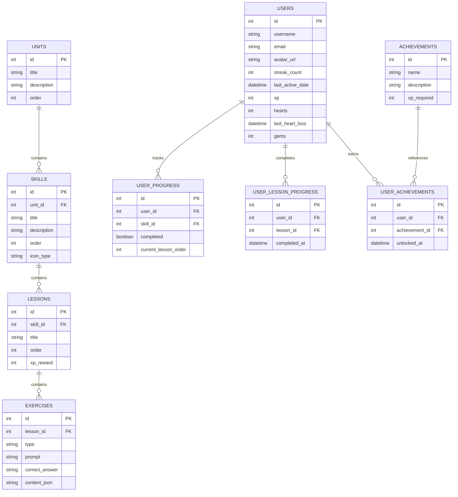

# 🦉 Duolingo Web App Clone — SDE Fullstack Assignment

[](https://nextjs.org/)
[](https://fastapi.tiangolo.com/)
[](https://sqlite.org/)
[](https://www.typescriptlang.org/)
[](https://www.python.org/)

A pixel-perfect, highly responsive clone of the Duolingo web application. Built for the SDE Fullstack Assignment, this application replicates Duolingo's signature gamification, layout aesthetics, and exercise core loop. The project features a structured SQLite schema, a high-performance Python FastAPI backend, and an interactive Next.js App Router frontend utilizing modular Vanilla CSS (no Tailwind) for custom layout fidelity.

---

## 🌟 Core Features

### 1. Learning Path / Skill Tree
* **Serpentine Progression Tree**: Units rendering vertical pathways with zig-zagging skill nodes.
* **Lock/Unlock States**: Advanced skills remain locked until prior prerequisite topics are completed.
* **Animated Progress Rings**: SVG circular progression indicators wrapped around skill icons that dynamically calculate progress.
* **Status Bar Header**: A top navigation panel showcasing active streaks 🔥, accumulated gems 💎, and remaining hearts ❤️ (with a live countdown).

### 2. Interactive Lesson Player (Core Loop)
* **Progress Meter**: Visual progress indicators that advance as questions are answered.
* **Multi-Format Exercises**:
  * `MULTIPLE_CHOICE`: Classic selector grids.
  * `TRANSLATE`: Tappable word banks that move tokens between choices and assembly zones.
  * `MATCH_PAIRS`: Matching grids with visual states for selected, correct, and vibrating incorrect options.
  * `FILL_IN_BLANK`: Sentence structures with option selectors.
  * `TYPE_ANSWER`: Open text input with translation grading.
* **Interactive Feedback Bar**: Immediate signature bottom panel notifications celebrating correct answers (green) or detailing corrections (red).
* **Audio Voice-Overs**: Uses the native browser **Web Speech API (`speechSynthesis`)** to pronounce Spanish phrases automatically during lessons.

### 3. Gamification Mechanics
* **Streak Maintenance**: Increments streak lengths if lesson completions occur on consecutive calendar days; resets if a day is missed.
* **Hearts Regeneration**: Decrements hearts on incorrect answers. Depleted hearts regenerate in the background at a rate of 1 heart per 15 minutes, synced via a background polling heartbeat.
* **Duo Shop**: Allows learners to spend earned gems to purchase full heart refills, or complete mock practice loops for free heart points.
* **Achievements Board**: Tracks milestone targets ("XP Milestone", "Streak Master", "Hearts Survivor") and renders percentage completion gauges.

---

## 🏗️ Architecture & Technical Design

### Backend (FastAPI + SQLAlchemy + SQLite)
* **Modular Design**: Structured into dedicated files for declarative DB models (`models.py`), request/response validation schemas (`schemas.py`), CRUD operations (`crud.py`), data seeding (`seed.py`), and routes mounting (`main.py`).
* **Dependency Injection**: Utilizes FastAPI dependency injection to yield database sessions per request, ensuring thread-safe database pooling.
* **Time-Based Heart Math**: Hearts are recalculated dynamically on queries using the elapsed duration since `last_heart_loss`, avoiding cron reliance.

### Frontend (Next.js 15 + TS + CSS Modules)
* **Context State Sync**: The `UserContext` maintains the global session profile, handles polling for heart regeneration timers, and manages refills.
* **Vanilla CSS Modules**: Scopes CSS classes to components to prevent style bleeding, utilizing custom variables for light/dark mode compliance.
* **Flexible Punctuation Grading**: Compares user responses against answer keys by normalizing cases and stripping punctuation tokens (`¿`, `?`, `¡`, `!`, `.`), minimizing learner frustration.

---

## 📁 Repository Layout

```
duolingo-clone/
├── backend/            # Python FastAPI backend service
│   ├── app/
│   │   ├── database.py # SQLAlchemy session generator
│   │   ├── models.py   # Declarative database tables
│   │   ├── schemas.py  # Pydantic request/response payload types
│   │   ├── crud.py     # Database transactional queries & logic
│   │   ├── seed.py     # Seed course curriculum & dummy accounts
│   │   └── main.py     # FastAPI app entry point & endpoints
│   ├── requirements.txt
│   └── venv/           # Python virtual environment
└── frontend/           # Next.js frontend client app
    ├── src/
    │   ├── app/        # Home path, leaderboard, profile, shop, lesson routes
    │   ├── components/ # Reusable UI views (Sidebar, TopBar, SkillNode, Player)
    │   ├── context/    # UserContext client session manager
    │   └── styles/     # Core typography, dark mode resets, colors
    ├── package.json
    └── tsconfig.json
```

---

## 📊 Database Schema Design

The SQLite database contains 8 relational tables designed for modular expansion:



---

## 🚀 Setup & Running Locally

### 1. Backend Server Setup
From the `backend` folder, set up a Python virtual environment, install packages, and boot the server:

```bash
cd backend

# Create and activate virtual environment
python3 -m venv venv
source venv/bin/activate  # On Windows use: venv\Scripts\activate

# Install dependencies
pip install -r requirements.txt

# Start the uvicorn development server
PYTHONPATH=. uvicorn app.main:app --port 8000 --reload
```

> [!NOTE]
> Upon initial startup, the backend checks for the default user `learner_duo`. If missing, it automatically initializes the SQLite `duolingo.db` file and populates it with unit lessons and mock users.

### 2. Frontend Client Setup
From the `frontend` folder, install package dependencies and start the local development server:

```bash
cd frontend

# Install npm packages
npm install

# Start the next development server
npm run dev
```

Open [http://localhost:3000](http://localhost:3000) to start learning Spanish.

---

## ☁️ Deployment Instructions

### 1. Deploy the Backend (e.g., Render, Railway)
1. Push your code to a public GitHub repository.
2. Log in to **Render** or **Railway** and create a new **Web Service**.
3. Link your GitHub repository.
4. Set the **Root Directory** to `backend`.
5. Set the **Build Command** to: `pip install -r requirements.txt`.
6. Set the **Start Command** to: `uvicorn app.main:app --host 0.0.0.0 --port $PORT`.
7. (Optional) Set up a persistent volume if you want database records to persist across restarts.

### 2. Deploy the Frontend (Vercel)
1. Log in to **Vercel** and create a new project.
2. Link your GitHub repository.
3. Set the **Root Directory** to `frontend`.
4. Vercel automatically detects Next.js configurations. Under **Environment Variables**, add:
   * `NEXT_PUBLIC_API_URL`: The URL of your deployed backend (e.g., `https://your-backend.onrender.com`).
5. Click **Deploy**.
